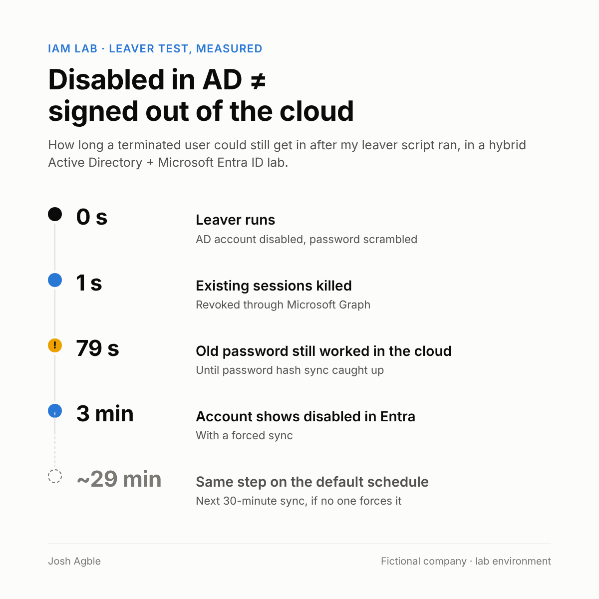

# PDS Identity Foundation

**Hybrid Active Directory + Microsoft Entra ID, run by an HR-driven joiner/mover/leaver engine**

I built the identity foundation for a fictional defense contractor, Potomac Defense Systems (PDS): a tiered AD domain synced to Entra ID, an engine that creates, changes and removes access based on an HR file, and the controls around it (separation of duties, measured offboarding, a privileged access review). Then I tested it with 340 people and planted a hidden Domain Admin to see if my review would catch it.

> **About this lab:** PDS is a fictional defense and space contractor. Every person, account, program and piece of data is made up, and nothing is classified. The lab runs in my own Azure subscription and Entra ID tenant. HR data was generated with LLM help, and the PowerShell scripts were drafted with LLM help. I designed the controls, ran every script, broke things, fixed them and verified the results myself. The [six walkthroughs](#walk-through-the-lab) have the full story, including the mistakes.

---

## Results at a glance

| What | Result |
|---|---|
| **Identities managed from HR** | 340 people (306 created in one run), then 22 overnight HR changes. Every result matched a pre-written answer key |
| **Offboarding, measured** | Sessions revoked in **1 s**. Old password still worked in the cloud at **79 s**. Account shown disabled in Entra after **3 min** with a forced sync vs **~29 min** on the default schedule, so the leaver now triggers the sync itself |
| **Secrets in the engine** | **Zero.** Graph uses a certificate with a non-exportable key; the engine runs as a gMSA nobody knows the password to |
| **Least privilege for automation** | Graph app: 2 permissions. Engine account: no admin rights anywhere, delegated only on `People`, `Disabled` and role groups |
| **Separation of duties** | Finance + Accounts Payable conflict: denied, allowed only with a valid exception, denied when the "approval" came from the person's own manager. 3/3 tests passed |
| **Privileged access review** | Found a Domain Admin hidden behind a nested group, plus standing Enterprise/Schema Admins I didn't plant, plus an AdminSDHolder leftover that broke helpdesk resets. All fixed and re-verified |

## Walk through the lab

The build is split into six parts. Each one is a step-by-step walkthrough in the order I did it, with annotated screenshots, including what broke and how I fixed it. Start at 1.1 and follow the links at the bottom of each page.

| Part | What happens | Highlights |
|:---:|---|---|
| [**1.1**<br>Plan and design](parts/1.1-plan-and-design/README.md) | OU design by security tier, a role map, and an HR roster with six planted edge cases | Why "make her like Bob" is the wrong way to grant access |
| [**1.2**<br>Build the domain](parts/1.2-build-the-domain/README.md) | Budget alerts, a domain controller in Azure, DNS, 21 OUs | Three failed VM deployments, and what they taught me about quotas |
| [**1.3**<br>Admin tiering](parts/1.3-admin-tiering/README.md) | `t0-`/`t1-`/`t2-` admin accounts, role and resource groups (AGDLP), helpdesk delegation | Tested as the helpdesk: allowed on a user, **Access is denied** on an admin |
| [**1.4**<br>Hybrid identity](parts/1.4-hybrid-identity/README.md) | Entra Connect Sync on its own Tier 0 server, OU filtering, just-in-time Enterprise Admin | Only 3 OUs reach the cloud. Admin accounts never do |
| [**1.5**<br>Lifecycle automation](parts/1.5-lifecycle-automation/README.md) | The JML engine: joiner, mover, leaver, SoD check, Graph app, gMSA, 340-person scale test | A fired employee's old password still worked at **79 s**. My "dry run" wasn't dry |
| [**1.6**<br>Security review](parts/1.6-security-review/README.md) | A planted hidden Domain Admin, a review that traces nesting, event 4728, AdminSDHolder | Found my planted problem, plus two I didn't plant |



---

## Architecture

```text
 HR roster (CSV)                       Microsoft Entra ID
      │                                 ▲            ▲
      ▼                                 │ sync       │ revoke sessions
 ┌─────────────────────────┐            │ (PHS,      │ (Graph API,
 │ JML engine on FRD-DC-01  │            │ OU-filtered)│ certificate auth)
 │ scheduled task as gMSA  │            │            │
 │ joiner → mover →        │──────────────────────────┘
 │ leaver → SoD check      │            │
 └───────────┬─────────────┘   ┌────────┴────────┐
             │ creates /       │  FRD-SYNC-01    │
             │ changes /       │  Entra Connect  │
             ▼ disables        │  Sync (Tier 0)  │
 ┌─────────────────────────┐   └────────▲────────┘
 │ Active Directory         │────────────┘ (leaver triggers a delta sync)
 │ ad.potomacdefense.internal│
 │ Tier 0/1/2 OUs, People,  │
 │ role + resource groups   │
 └─────────────────────────┘
```

- **Two VMs in Azure:** `FRD-DC-01` (domain controller) and `FRD-SYNC-01` (Entra Connect Sync, no inbound ports, reached only through the DC)
- **Synced to Entra:** only `People`, `Groups\Role` and `Disabled`. Admin accounts, service accounts and resource groups never leave AD
- **AD is the source of truth.** Synced groups are read-only in Entra, and changes flow up

## What's in this repo

| Path | What it is |
|---|---|
| [`parts/`](parts/) | The six walkthroughs, each with its own annotated screenshots |
| [`docs/01-directory-design.md`](docs/01-directory-design.md) | OU design by security tier, admin tiering, group model (AGDLP), sync scope |
| [`docs/02-role-map.md`](docs/02-role-map.md) | Birthright vs conditional access, program checks (CUI training, US person, PM approval), SoD rules, exceptions |
| [`docs/03-jml-runbook.md`](docs/03-jml-runbook.md) | How to do joiner, mover, leaver and SoD by hand, and what the engine does instead |
| [`docs/04-privileged-access-review.md`](docs/04-privileged-access-review.md) | Findings report from the security review |
| [`docs/build-log.md`](docs/build-log.md) | The condensed notes version of all six parts |
| `scripts/03-joiner.ps1` | Creates accounts from HR: birthright groups, program groups only when all checks pass, future hires disabled |
| `scripts/04-mover.ps1` | Fixes drift: start dates, program transfers, job-role groups, managers |
| `scripts/05-leaver.ps1` | Disables, scrambles password, revokes Entra sessions (Graph), cleans up, triggers a sync |
| `scripts/06-sod-check.ps1` | Finance + AP conflict check with an exceptions register and event log alerts |
| `scripts/07-privileged-access-review.ps1` | Read-only review of 12 privileged groups, nested paths, AdminSDHolder leftovers |
| `scripts/run-jml.ps1` | Runs the engine in order with a full transcript. Used by the scheduled task |
| `data/` | Original 26-person HR roster, the 340-person scale test rosters, the answer key, the SoD exceptions register |
| `evidence/` | Logs the system actually produced, and screenshots |

## Design decisions worth asking me about

- **EmployeeID, never names.** Every match (HR to AD, AD to Entra, manager links) uses EmployeeID. Names change and repeat
- **Program access is an attribute, not an OU.** A transfer is a data change, not an account move
- **Cut access before cleanup, remove before add.** If a run fails halfway, the person ends up with too little access, never too much
- **The engine only reverses what it did.** It re-enables "Pre-start" accounts only; anything else disabled is flagged for review
- **Certificate over client secret, gMSA over a service account password.** No secret exists for someone to leak into a script, a chat or GitHub
- **Detective + corrective, not just preventive.** AD can't block a toxic group combination, so the SoD check runs on a schedule and alerts to the event log for a SIEM

## Evidence

| File | Shows |
|---|---|
| `evidence/logs/jml-run-*.log` | Day 2 of the scale test, run by `PDS\gmsa-jml$`: 5 joiners, 10 movers, 8 leavers, sync triggered |
| `evidence/logs/leaver-*.csv` | Timestamped leaver audit trail |
| `evidence/logs/sod-alerts.csv` | SoD decisions: denied, allowed by exception, denied |
| `evidence/logs/privileged-review-*.csv` | Final clean privileged access review |
| [`evidence/`](evidence/README.md) | Every screenshot, named by build section, in one gallery |

## What I'd do differently in production

- Run the engine from a dedicated **Tier 0 management server**, not a domain controller
- Put requests, approvals and SoD exceptions in an **IGA tool** (Entra ID Governance, SailPoint), so the mover and SoD check agree on approved exceptions
- Add a **Conditional Access block group** for leavers, so the cloud block doesn't depend on sync at all
- **Load AD once per run** instead of one lookup per person, for 10,000+ users
- Send `PDS-JML` events to a **SIEM** (Sentinel or Splunk) and alert on any Domain Admins change
- Approve privileged access per **account + group**, and add **BloodHound** to see ACL-based paths a group review can't
- No RDP from home IPs: **Bastion or Just-In-Time VM access**, and the KDS root key created a day ahead instead of backdated
- **Delete** accounts after the 30-day retention in `Disabled`, with the certificate in Key Vault or an HSM and a rotation runbook

## Skills

Active Directory design and administration · admin tiering · delegation · AGDLP · RBAC and attribute-based program access · Entra Connect Sync (password hash sync, OU filtering) · Microsoft Graph API · app registrations with certificate auth · PowerShell automation · group Managed Service Accounts · Task Scheduler · separation of duties · privileged access review · AdminSDHolder · Windows Security event analysis · NIST SP 800-171 alignment (CUI, personnel actions)

---

Built by **Josh Agble** · [github.com/jagble](https://github.com/jagble)
