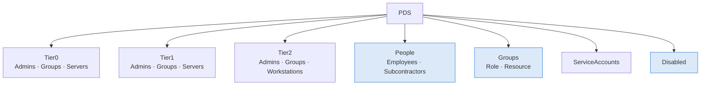
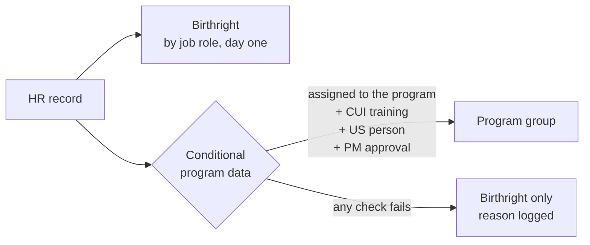

# Part 1.1: Plan and design

[← Back to the project](../../README.md) · **1.1** · [1.2 Build the domain →](../1.2-build-the-domain/README.md)

> **In this part:** before touching Azure, I decided how the directory would be organized, who gets what access, and what the HR data looks like. Everything later in the lab follows these three decisions.
>
> **Time:** about half a day · **Output:** [directory design](../../docs/01-directory-design.md), [role map](../../docs/02-role-map.md), [HR roster](../../data/hr-roster.csv)

---

## The company

Potomac Defense Systems (PDS) is a fictional defense and space contractor I made up for this lab: about 300 employees and 40 subcontractors in Fredericksburg, Dahlgren and Chantilly, working on three programs (**Radar**, **Satellite** and **Shipboard**). Program data is CUI (Controlled Unclassified Information), so who sees it matters.

The first thing I did was create the GitHub repo and add a `.gitignore` that blocks `*.pfx`, `*.pem`, `*.key`, `.env` and similar files. That way a password or private key can't end up here by accident.

## Step 1: Organize the directory by security level, not department

The usual instinct is OUs per department or office. I went the other way: OUs are where **delegation, Group Policy and sync scope** apply, so they should follow security boundaries.



The decision that matters most: **admin accounts live in their own OUs, outside `People`.** Later, when I give the helpdesk password-reset rights on `People`, it's impossible for them to reset an admin's password, because no admin account is in there. One OU decision does the work of a lot of exceptions.

While writing this I also realized the **sync server is Tier 0**. It can read every password hash in the domain, so it gets treated like a domain controller.

The shaded OUs (`People`, `Groups\Role`, `Disabled`) are the only ones that will sync to the cloud in [Part 1.4](../1.4-hybrid-identity/README.md).

## Step 2: Decide who gets what (the role map)

The common way access gets granted is "make her like Bob." That copies everything Bob ever collected, including access he shouldn't have. I split access into two kinds instead:



- **Birthright:** everyone gets `GG-Role-AllStaff`, plus one group for their job (Engineers, Finance, HR and so on)
- **Conditional:** program data (Radar, Satellite, Shipboard) needs **all four** checks: assigned to the program, CUI training done, US person (export control), and the program manager's approval

**My first draft was wrong in three ways**, and fixing them shaped the whole project:

| First draft | Problem | What I changed |
|---|---|---|
| Every engineer got program data on day one | CUI is need-to-know, not job-title-to-know | Program access needs all four checks |
| Programs were OUs | A transfer would mean moving the account | Program is an **attribute** (`division`), so a transfer is a data change |
| One person could hold Finance and Accounts Payable | They could create a fake vendor and approve its invoice | Blocked by default. Exceptions need outside approval, a time limit and a compensating control |

That last row becomes the separation-of-duties check in [Part 1.5](../1.5-lifecycle-automation/README.md#7-separation-of-duties).

## Step 3: Create the HR data

IAM reacts to HR, never the other way around, so I needed an HR export to drive everything. I created [`data/hr-roster.csv`](../../data/hr-roster.csv), with 26 fictional people standing in for something like a Workday export:

```text
EmployeeID,FirstName,LastName,WorkerType,Department,JobTitle,Office,ManagerID,Program,CUITraining,USPerson,ProgramApproved,StartDate,EndDate,Status
100100,Diane,Whitaker,Employee,Executive,Chief Executive Officer,Fredericksburg,,,Yes,Yes,,2015-03-02,,Active
```

Two rules I set here and never broke:
- **Match on EmployeeID, never on name.** Names change and repeat
- **Plant test cases on purpose.** I wanted the automation to have to get hard cases right, so I picked six:

| Test case | What should happen |
|---|---|
| Engineer with no CUI training | Account yes, program data no |
| Non-US person assigned to a program | Account yes, program data no |
| Program access not approved by the PM | Account yes, program data no |
| Start date in the future | Account created **disabled** |
| Terminated employee | No account |
| Contractor whose end date passed, but HR still says **Active** | No account (HR forgot to update them) |

The data was generated with LLM help; I chose the test cases. Every one of them comes back in Part 1.5.

## What I had at the end of 1.1

- [x] A directory design built around tiers, delegation and sync scope
- [x] A role map with birthright vs conditional access and an SoD rule
- [x] An HR roster with six deliberate edge cases

---

[← Back to the project](../../README.md) · **1.1** · [Next: 1.2 Build the domain →](../1.2-build-the-domain/README.md)
