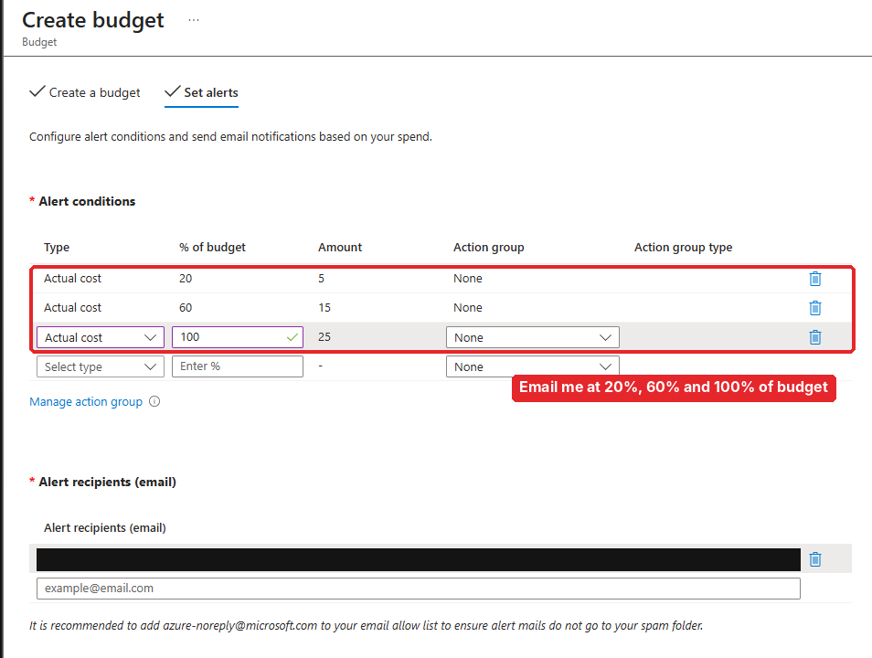
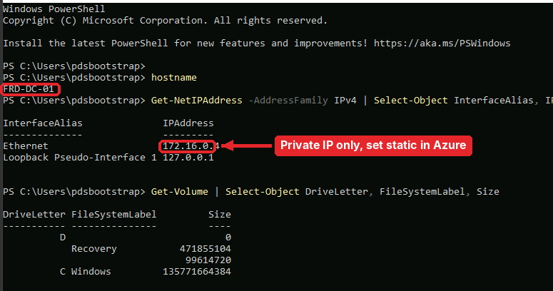
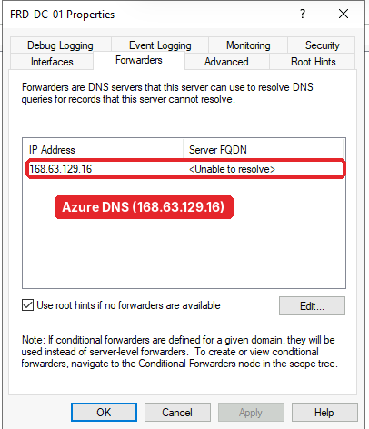
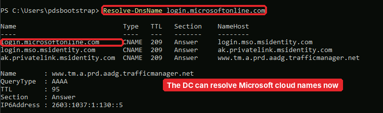
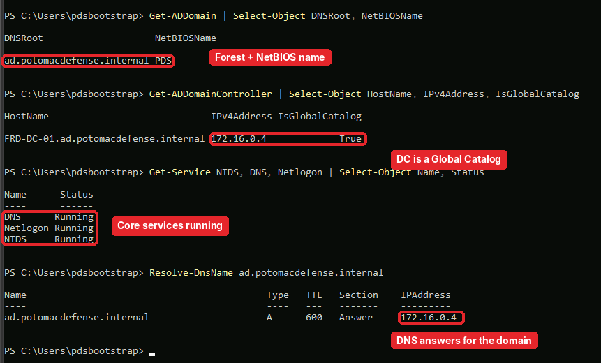
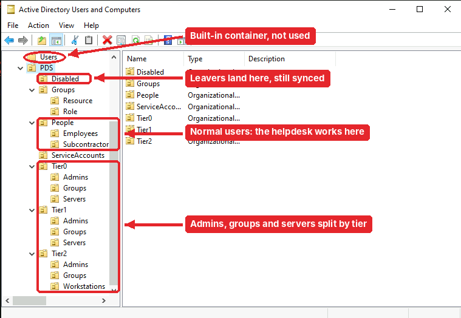

# Part 1.2: Build the domain

[← 1.1 Plan and design](../1.1-plan-and-design/README.md) · **1.2** · [1.3 Admin tiering →](../1.3-admin-tiering/README.md)

> **In this part:** I set up cost alerts, got a domain controller running in Azure (after three failed deployments), locked down remote access, created the `ad.potomacdefense.internal` forest and built the OU structure from Part 1.1.
>
> **Server:** `FRD-DC-01` · **Domain:** `ad.potomacdefense.internal` (NetBIOS `PDS`)

---

## Step 1: Set a budget before building anything

Cloud labs get expensive when you forget something is running, so the first click was a budget, not a VM.

I started at $25 with email alerts at 20%, 60% and 100%. I raised it to $75 later, after the VM size changed (next step). Every VM also gets a nightly auto-shutdown.

## Step 2: Get a VM that will actually deploy

This took three tries:

1. **B2s:** not offered in the region
2. **Bsv2:** `QuotaExceeded`. My subscription had 0 cores for that family, and free trials can't request more
3. **B2s again:** blocked for my subscription, even though the family showed quota

So I pulled the quota report, found families that actually had cores available, and deployed `D2nlds_v6` (about $0.23/hour).

**What I learned:** a VM size has to pass three separate gates: region capacity, size restrictions, and family quota. I also learned to check a resource's region on its Overview page. Mine was in East US, not East US 2 like I'd assumed.

## Step 3: Close the front door

When the VM was created, RDP was open to the whole internet. I deleted that rule right away.

Then I couldn't get in either. The free Bastion tier wasn't available on my subscription, and my work network blocks RDP. I used paid Bastion for one session, deleted it afterward, and replaced the rule with **RDP allowed only from my home IP**. VMs are stopped after every session.

## Step 4: Give the DC a static IP (in Azure, not Windows)

A domain controller's IP can never change, because every machine finds the domain through it. In Azure you set that on the **network interface in the portal**, not inside Windows. Windows keeps getting its address from DHCP, and Azure always hands it the same one.

## Step 5: Promote to a domain controller

I installed AD DS and created a new forest, `ad.potomacdefense.internal`, with the NetBIOS name `PDS`.

During promotion you'll see a "can't create DNS delegation" warning. That's expected: `.internal` has no parent zone to delegate from.

**What broke:** promotion set the DC's own DNS server to `127.0.0.1` inside Windows, which overrode Azure's network settings. I switched it back to automatic so DNS is managed in one place (Azure), then pointed the virtual network's DNS at the DC.

## Step 6: Let the DC resolve internet names

The DC is now the DNS server for the domain, but it also needs to resolve outside names (like Microsoft's login servers in Part 1.4). I added a **forwarder** to Azure's DNS resolver:

`168.63.129.16` is Azure's built-in resolver address. "Unable to resolve" in the FQDN column is normal; it just means that IP has no reverse name. The real test is whether a lookup works:

## Step 7: Prove the domain works

Before building on top of it, I checked four things:

| Check | Command | What I wanted to see |
|---|---|---|
| Forest exists | `Get-ADDomain` | `ad.potomacdefense.internal`, `PDS` |
| DC is a Global Catalog | `Get-ADDomainController` | `IsGlobalCatalog: True` |
| Core services | `Get-Service NTDS, DNS, Netlogon` | All running |
| DNS answers for the domain | `Resolve-DnsName` | `172.16.0.4` |

## Step 8: Build the OU structure

I created all 21 OUs from the design, with **protect from accidental deletion** on:

Notice the built-in `Users` container at the top. It's a **container, not an OU**, so you can't link Group Policy to it or delegate it cleanly. PDS doesn't use it. (Remember that. In [Part 1.6](../1.6-security-review/README.md) someone hides a group in there.)

## What I had at the end of 1.2

- [x] Budget alerts and nightly shutdown
- [x] `FRD-DC-01` with a static private IP, RDP only from my home IP
- [x] Forest `ad.potomacdefense.internal`, DNS working inside and out
- [x] 21 OUs matching the design

---

[← 1.1 Plan and design](../1.1-plan-and-design/README.md) · **1.2** · [Next: 1.3 Admin tiering →](../1.3-admin-tiering/README.md)
