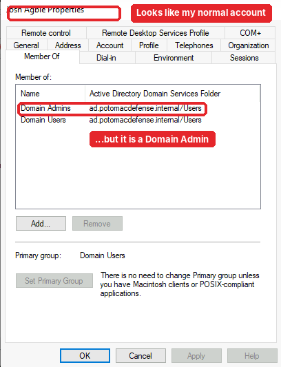
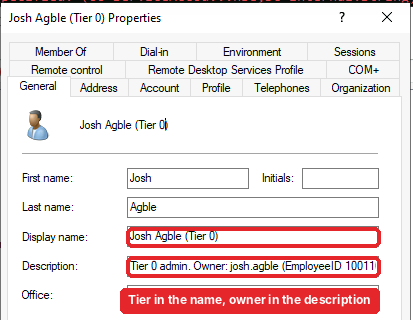
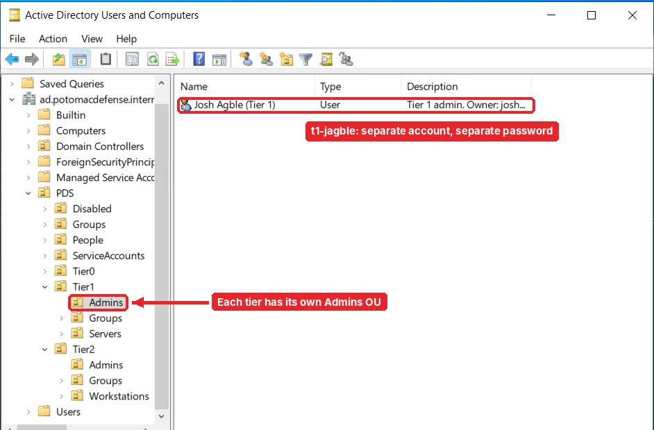
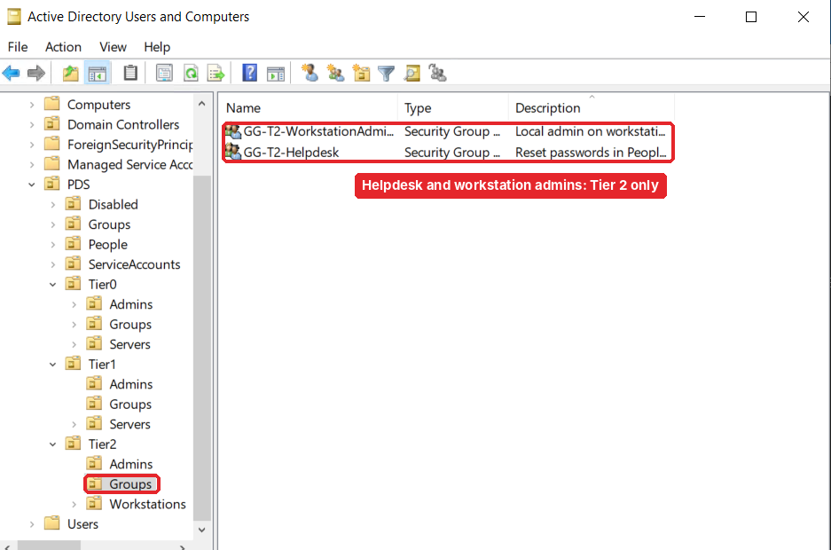
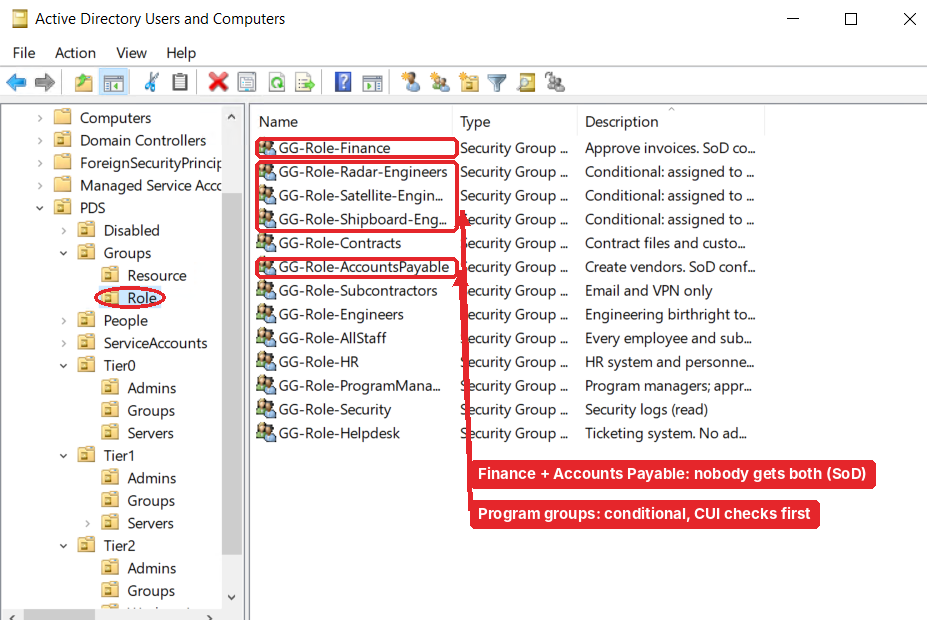
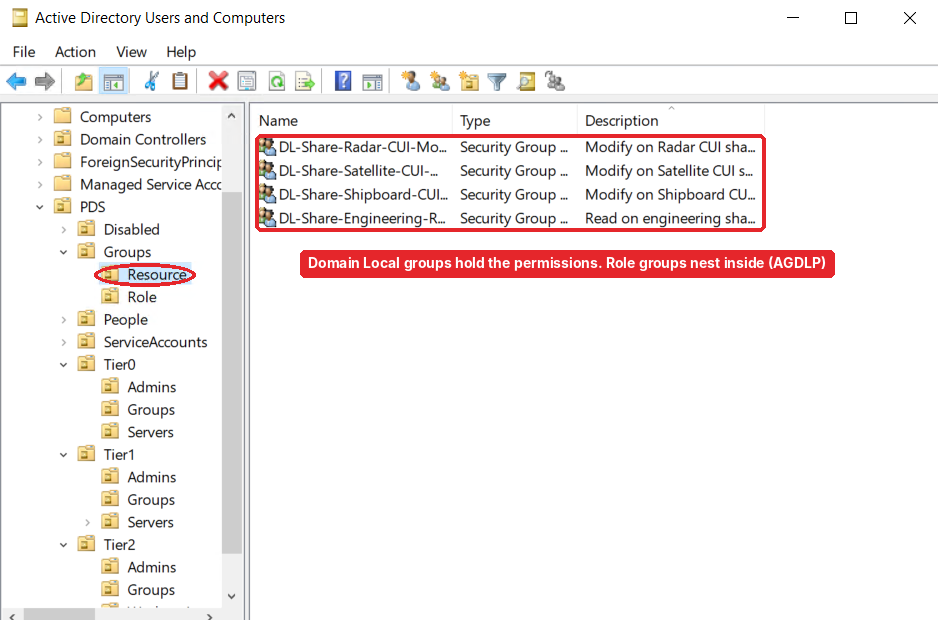
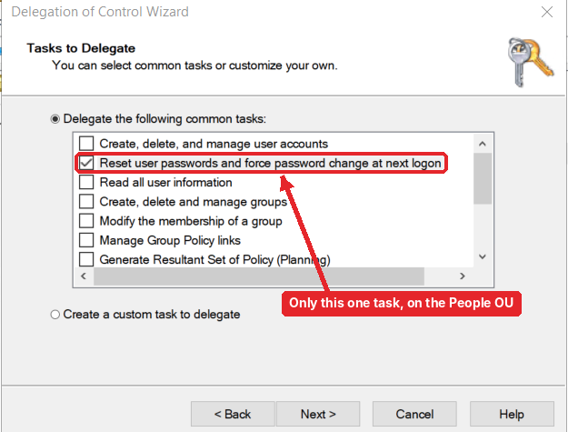
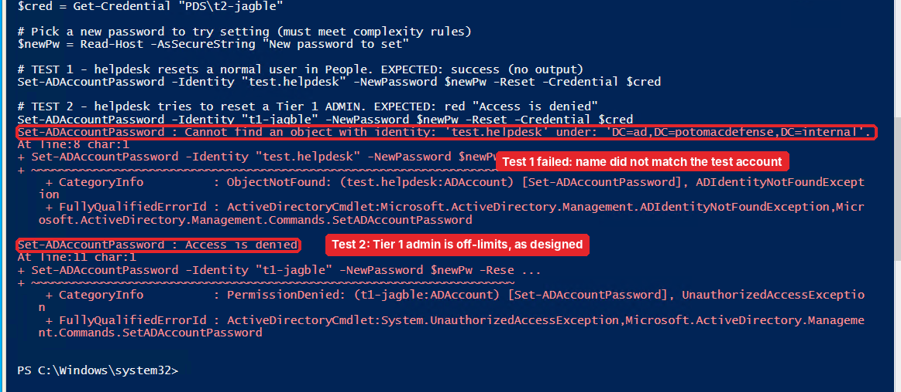
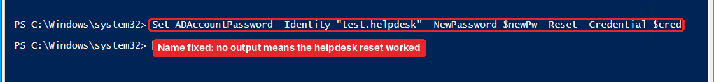

# Part 1.3: Admin tiering and the access model

[← 1.2 Build the domain](../1.2-build-the-domain/README.md) · **1.3** · [1.4 Hybrid identity →](../1.4-hybrid-identity/README.md)

> **In this part:** I stopped using the built-in Administrator, gave myself a separate admin account per tier, built the role and resource groups from the role map, and gave the helpdesk exactly one right. Then I tested it **as the helpdesk**, not as myself.

---

## Step 1: One admin account per tier

Up to now I'd been working as the built-in Administrator (`pdsbootstrap`). The goal is that a stolen lower-tier password can never unlock a higher tier, so each tier gets its own account with its own password:

| Account | Tier | Lives in | Can manage |
|---|---|---|---|
| `t0-jagble` | 0 | `Tier0\Admins` | AD, domain controllers, the sync server |
| `t1-jagble` | 1 | `Tier1\Admins` | Servers and applications |
| `t2-jagble` | 2 | `Tier2\Admins` | Workstations, helpdesk tasks |

**First mistake:** my Tier 0 account came out with the display name "Josh Agble", exactly like my normal user account would. Here it is, a Domain Admin that looks like anybody:



In a list of names, nobody would spot that as a Domain Admin. I renamed every admin account to show the tier, and put the owner in the description (my normal account and EmployeeID), so offboarding can find every account a person owns:



Each tier's account sits in that tier's `Admins` OU:



From here on, all admin work happens as `t0-jagble`, and the built-in Administrator becomes break-glass only.

## Step 2: Admin groups

Rights go on groups, never directly on people. The Tier 2 groups:



Plus `GG-T1-ServerAdmins` for Tier 1. Nothing is nested into Domain Admins. Nesting groups into Domain Admins is exactly how hidden admin paths form, which comes back in Part 1.6.

## Step 3: Role groups and resource groups (AGDLP)

From the role map, I created 13 **role groups** (Global, who you are) and 4 **resource groups** (Domain Local, what a resource allows) with a PowerShell script (drafted with LLM help; I reviewed, ran and verified it).



The two pairs to notice:
- **Finance + Accounts Payable:** the separation-of-duties pair. Nobody should end up in both
- **Radar / Satellite / Shipboard Engineers:** conditional groups. Only people who pass all four program checks get in

The resource groups hold the actual permissions on the CUI shares:



Then the role groups nest into the resource groups. This is AGDLP: **A**ccounts → **G**lobal → **D**omain **L**ocal → **P**ermissions.

```text
Jordan Carter → GG-Role-Radar-Engineers → DL-Share-Radar-CUI-Modify → Radar CUI share (Modify)
```

Granting or removing access is now one membership change, and the share's permissions never change.

## Step 4: Give the helpdesk exactly one right

The helpdesk needs to reset passwords. That's all. In ADUC, I right-clicked `People` → **Delegate Control** → `GG-T2-Helpdesk`, and checked a single box:



Because admin accounts live in the `Tier` OUs and not under `People`, this right can't reach them. That's the OU design from Part 1.1 paying off.

## Step 5: Test it as the helpdesk, not as me

Testing as `t0-jagble` would prove nothing; Domain Admins can reset anyone. So I ran both tests with `t2-jagble`'s credentials:

1. Reset a normal user in `People` → should work
2. Reset `t1-jagble`, a Tier 1 admin → should fail



Test 2 did exactly what it should: **Access is denied.** Test 1 failed for a dumb reason. The name I typed didn't match the test account's logon name, so AD couldn't find it. I fixed the name and re-ran it:



No output in PowerShell means success.

| Test | Target | Result |
|---|---|---|
| 1 | Normal user in `People` | ✅ Allowed |
| 2 | `t1-jagble` (Tier 1 admin) | ⛔ Access is denied |

I deleted the test account afterward. (I missed one leftover, and it turned up in Part 1.5 before the first sync.)

## What I had at the end of 1.3

- [x] `t0-`, `t1-`, `t2-` accounts, clearly named, built-in Administrator retired to break-glass
- [x] Admin groups per tier, 13 role groups, 4 resource groups, AGDLP nesting
- [x] Helpdesk can reset `People` passwords and nothing else, tested as the helpdesk

---

[← 1.2 Build the domain](../1.2-build-the-domain/README.md) · **1.3** · [Next: 1.4 Hybrid identity →](../1.4-hybrid-identity/README.md)
