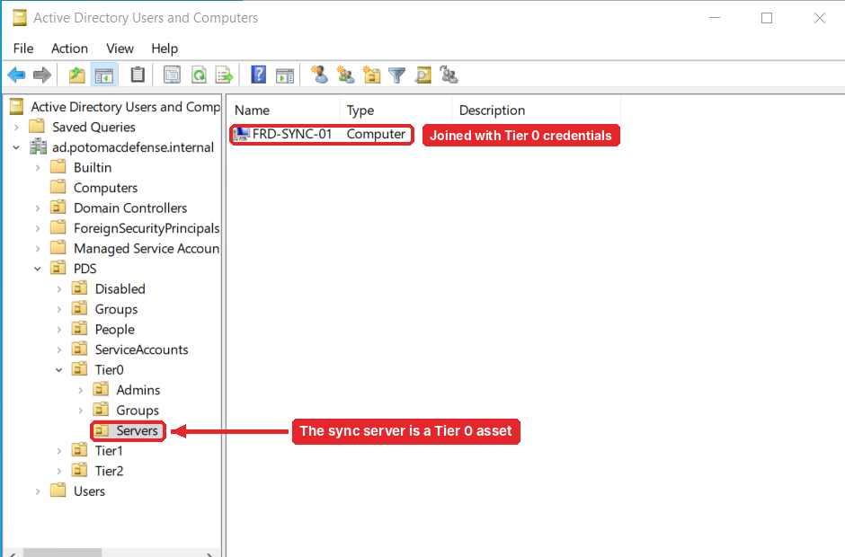
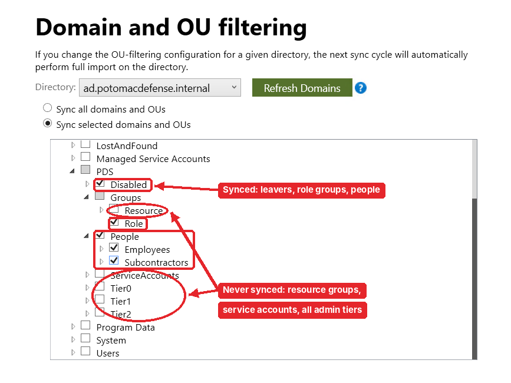
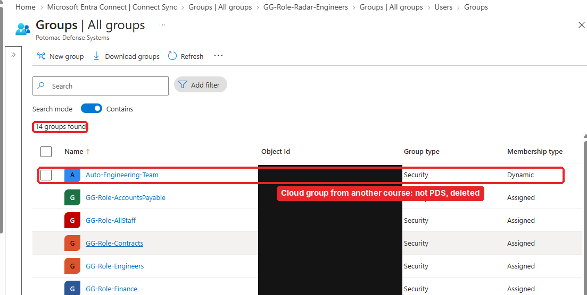
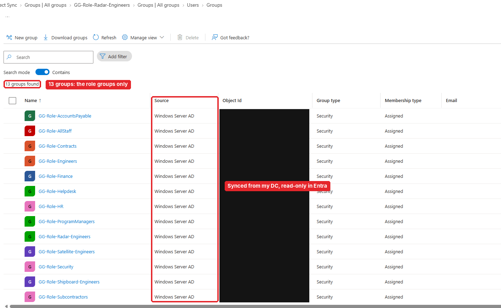

# Part 1.4: Hybrid identity

[← 1.3 Admin tiering](../1.3-admin-tiering/README.md) · **1.4** · [1.5 Lifecycle automation →](../1.5-lifecycle-automation/README.md)

> **In this part:** I built a second server just for Microsoft Entra Connect Sync, installed it with just-in-time Enterprise Admin rights, and synced **only** the OUs that need the cloud. Admin accounts never leave AD.
>
> **Server:** `FRD-SYNC-01` · **Tenant:** `PotomacDefenseSystems.onmicrosoft.com`

---

## Step 1: A separate server, treated as Tier 0

Entra Connect Sync can read every password hash in the domain. Whoever controls that server effectively controls the domain, so it's **Tier 0** and gets its own VM instead of sharing the DC.

- **No inbound ports at all.** I reach it only by RDP from the DC, which works as a jump server
- Static IP, joined to the domain with Tier 0 credentials
- Computer object moved to `Tier0\Servers`

**What broke:** halfway through, the 11 PM auto-shutdown cut off my session. Nothing was lost (AD writes changes immediately), but now for long sessions I move the shutdown time later and put it back afterward.

## Step 2: Just-in-time Enterprise Admin for the install

Entra Connect's installer needs **Enterprise Admins** to create its service account and set permissions. My Tier 0 account doesn't hold that normally, so I added `t0-jagble` to Enterprise Admins for the install **and removed it right after**. That's just-in-time access: the right exists for the minutes it's needed, not forever.

(Part 1.6 found out that "Enterprise Admins is just-in-time" wasn't completely true. Something else had been sitting in that group since day one.)

I downloaded the installer on the sync server from Microsoft's portal only. That's a one-time, documented exception to my "no browsing from Tier 0" rule.

## Step 3: Custom install, not Express

Express would sync **everything**, including admin accounts and service accounts. I chose **Custom** with:

- **Password hash sync** (users sign in to the cloud with their AD password)
- No verified domain, so synced users sign in as `first.last@PotomacDefenseSystems.onmicrosoft.com`
- **OU filtering:** only three OUs in scope

| Synced | Why |
|---|---|
| `People` | Everyone who needs Microsoft 365 / cloud apps |
| `Groups\Role` | So cloud apps can use the same role groups |
| `Disabled` | Leavers stay in scope on purpose. If they left the scope, Entra would **delete** the cloud account instead of showing it as disabled |

| Never synced | Why |
|---|---|
| `Tier0`, `Tier1`, `Tier2` | A cloud compromise should never touch an on-prem admin account |
| `ServiceAccounts` | Non-human accounts have no business in the cloud |
| `Groups\Resource` | They grant on-prem file permissions; the cloud doesn't need them |

## Step 4: Clean up the tenant

After the first sync, the group list showed 14 groups when it should have been 13:

`Auto-Engineering-Team` was a dynamic group left over from another course I'd used this tenant for. Not part of PDS, so I deleted it. (Object IDs are blacked out in these screenshots.)

## Step 5: Verify what came across

- All **13 role groups** arrived with **Source: Windows Server AD**
- **No** resource groups, admin groups or admin accounts
- Synced groups are **read-only in Entra.** You can't add members there. AD is the source of truth and changes flow up

That last point matters for everything in Part 1.5: to change anyone's access, the engine changes AD and lets sync carry it to the cloud.

## What I had at the end of 1.4

- [x] `FRD-SYNC-01`, Tier 0, no inbound ports
- [x] Entra Connect Sync with password hash sync, installed with just-in-time Enterprise Admin
- [x] Only `People`, `Groups\Role` and `Disabled` in the cloud
- [x] A clean tenant with only PDS objects

---

[← 1.3 Admin tiering](../1.3-admin-tiering/README.md) · **1.4** · [Next: 1.5 Lifecycle automation →](../1.5-lifecycle-automation/README.md)
