# Part 1.5: Lifecycle automation (the JML engine)

[← 1.4 Hybrid identity](../1.4-hybrid-identity/README.md) · **1.5** · [1.6 Security review →](../1.6-security-review/README.md)

> **In this part:** the main event. I built a joiner/mover/leaver (JML) engine that reads the HR roster and creates, changes and removes access on its own. I did each process **by hand first**, then automated it, ran every piece read-only before letting it change anything, measured how long a fired employee could still get in, and finally ran it unattended at 340 people.
>
> **Scripts:** [`03-joiner.ps1`](../../scripts/03-joiner.ps1) · [`04-mover.ps1`](../../scripts/04-mover.ps1) · [`05-leaver.ps1`](../../scripts/05-leaver.ps1) · [`06-sod-check.ps1`](../../scripts/06-sod-check.ps1) · [`run-jml.ps1`](../../scripts/run-jml.ps1) · [Runbook](../../docs/03-jml-runbook.md)

This is the longest part, so here's the map:

| # | Section | The lesson |
|---|---|---|
| 1 | [Joiner](#1-joiner) | Read-only first, and check the server clock |
| 2 | [Mover](#2-mover) | The engine caught my own manual mistake |
| 3 | [Doing it by hand](#3-doing-it-by-hand-first) | Locked out ≠ disabled. Disabled in AD ≠ signed out of the cloud |
| 4 | [Graph access](#4-giving-the-engine-cloud-access) | An empty result can look exactly like "doesn't exist" |
| 5 | [Leaver + exposure window](#5-leaver-and-the-exposure-window) | The old password still worked 79 seconds later |
| 6 | [Closing the gap](#6-closing-the-gap) | The leaver triggers its own sync |
| 7 | [Separation of duties](#7-separation-of-duties) | Detective + corrective, with an exceptions register |
| 8 | [Running unattended](#8-running-unattended-as-a-gmsa) | A gMSA with rights granted to a group |
| 9 | [Scale test: 340 people](#9-scale-test-340-people) | My "dry run" wasn't dry |

---

## 1. Joiner

**Goal:** for every person in HR who doesn't have an account yet, create one with the right groups.

I built `03-joiner.ps1` in five small pieces, and ran each piece **read-only** before adding the next. Nothing made a change until the last piece, and even then only when a `$DryRun` switch was off.

### Piece 1: read the HR roster

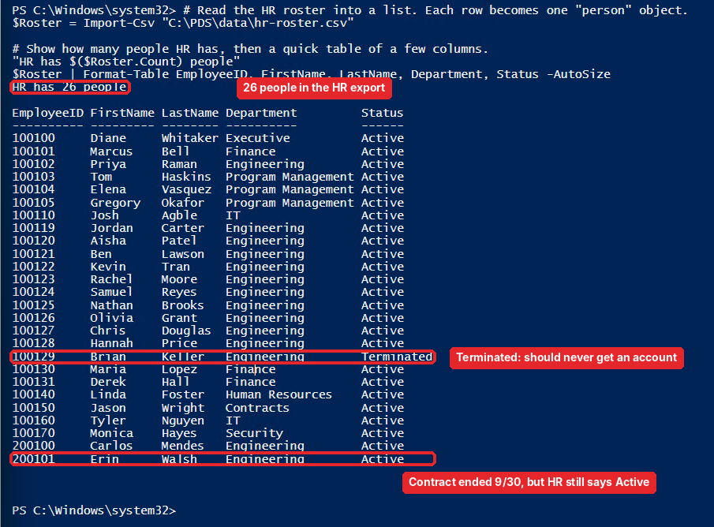

Two of the planted test cases are already visible. Brian is **Terminated**. Erin is a contractor whose contract ended 9/30, but HR still shows her as **Active**. The engine has to catch Erin anyway.

### Piece 2: match people to AD by EmployeeID

Before matching, I caught a problem: the server clock was on **UTC**. At 9 PM Eastern it already thought it was tomorrow, which would have enabled Hannah (start date 10/5) a day early. I set the time zone first.

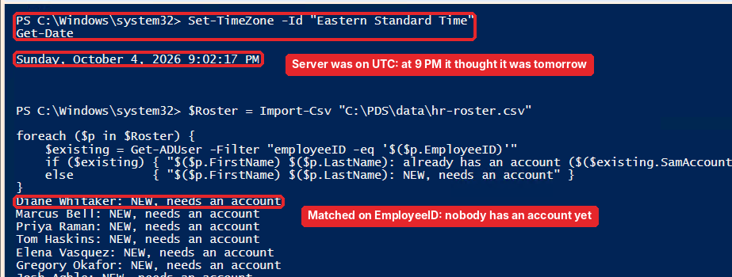

Every match uses `employeeID`, never a name. Nobody has an account yet, so everyone is NEW.

### Piece 3: decide create or skip

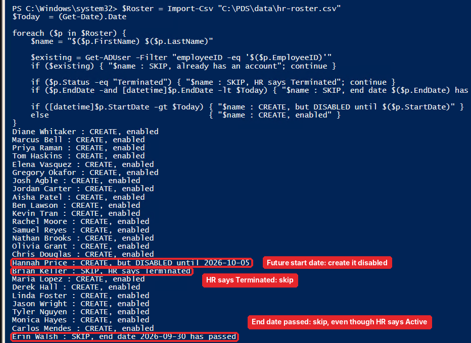

All three edge cases came out right:
- **Hannah:** start date in the future → create, but **disabled**
- **Brian:** HR says Terminated → skip
- **Erin:** end date passed → skip, **even though HR says Active**

### Piece 4: decide groups

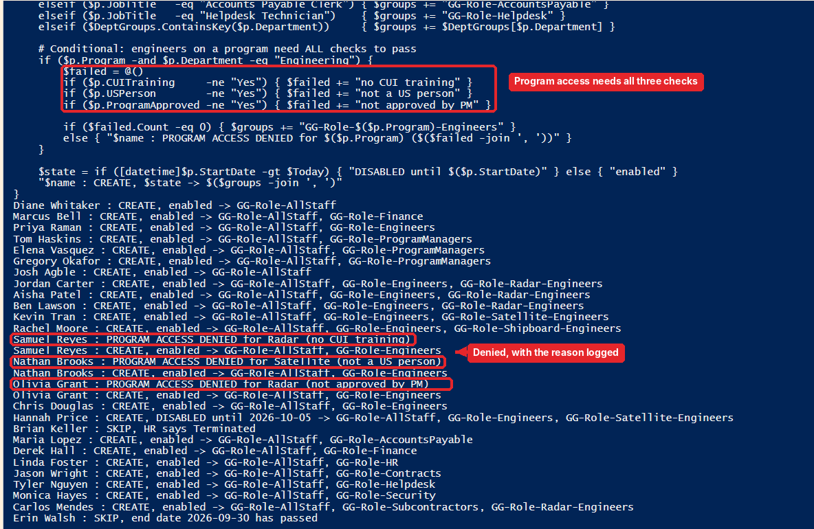

Everyone gets `GG-Role-AllStaff` plus their job's group. Program groups need **every** check to pass, and when one fails, the reason is printed:

| Person | Denied because |
|---|---|
| Samuel Reyes | No CUI training |
| Nathan Brooks | Not a US person |
| Olivia Grant | Program manager hasn't approved |

They still get their job's access. They just don't see program data.

### Piece 5: create the accounts

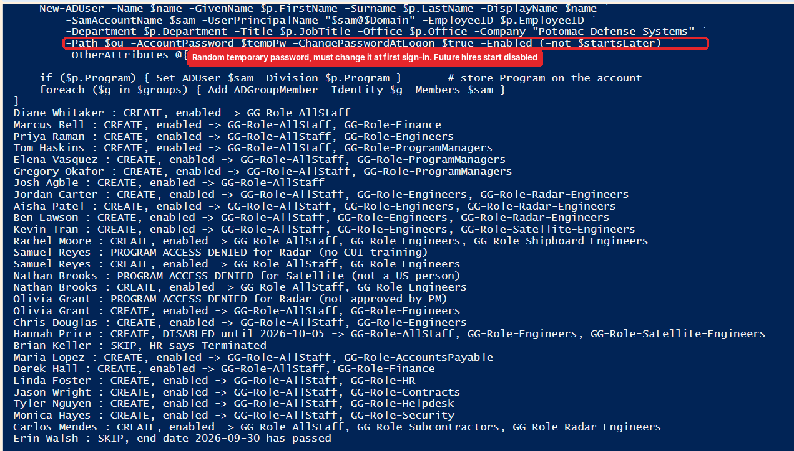

Each account gets a 16-character random temporary password that's never shown or saved, and must be changed at first sign-in. The real run created **24 accounts** (23 employees, 1 subcontractor):

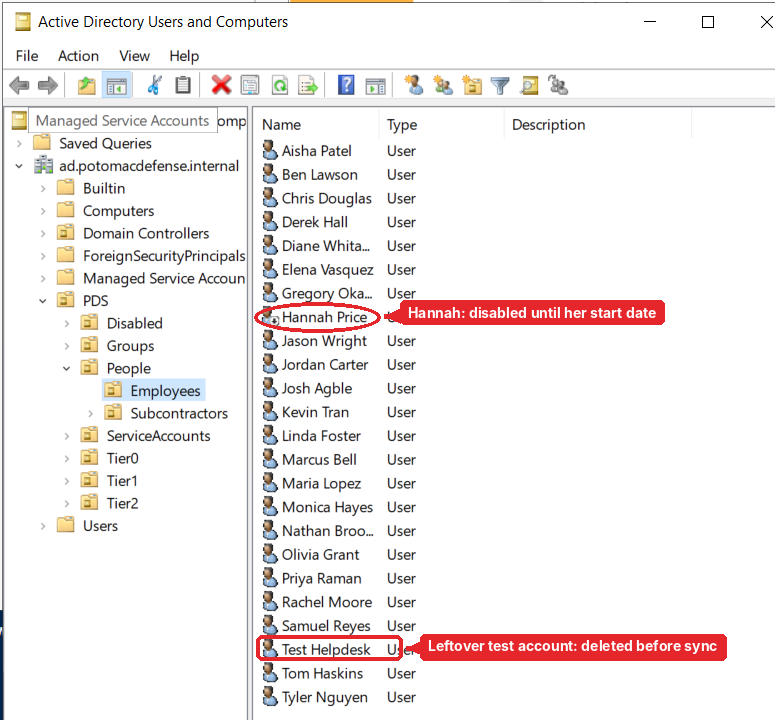

Two things to notice:
- Hannah's icon has the little down arrow: **disabled until her start date.** But nothing said *why*. Anyone reviewing AD would have to guess: pre-hire? leaver? suspended? So I gave her a description (`Pre-start: account disabled until start date 2026-10-05 (HR)`) and updated the joiner to add it automatically
- **Test Helpdesk** was still there from Part 1.3. I deleted it before the first sync to Entra

### Checking the result in the cloud

After a sync, the Radar group in Entra has exactly the four engineers who passed every check:

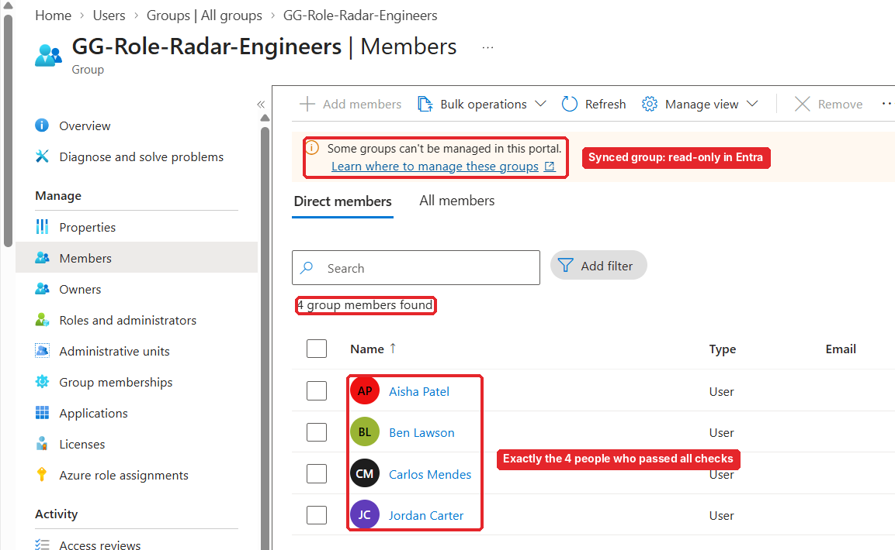

The banner at the top ("Some groups can't be managed in this portal") is Entra telling you it's a synced group. You can't add members there. AD is the source of truth.

---

## 2. Mover

**Goal:** compare every existing account to HR and fix three kinds of drift: start date arrived, program changed, and job-role groups that are wrong.

### Start date arrives

Before writing anything, I checked Hannah. She's disabled, with the reason in the description:

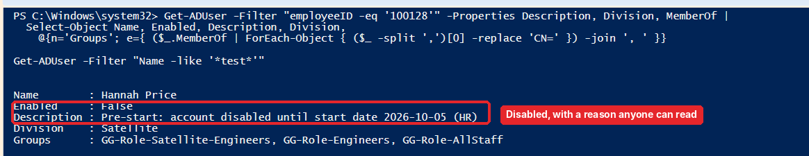

The mover's first piece re-enables accounts whose start date has arrived. But it only touches accounts **the joiner disabled** (the `Pre-start` note). Any other disabled account gets flagged for review, because security may have disabled it on purpose.

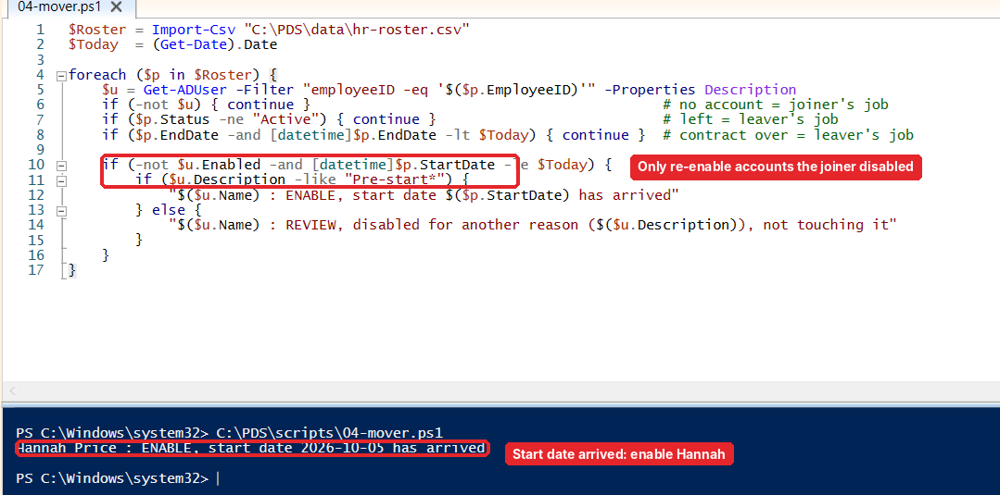

**What broke:** when I added the part that actually enables her, I accidentally replaced the outer line that checks the start date:

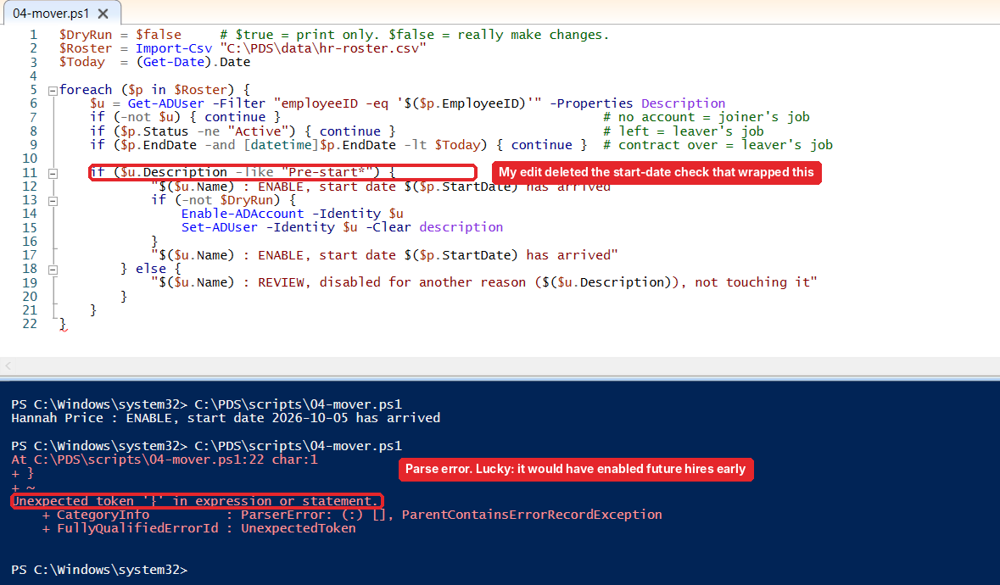

The script failed to parse, which was lucky. If it had run, it would have enabled **every** pre-start account regardless of start date, including future hires. From then on I replaced whole files instead of editing individual lines.

### Program transfer, done by hand first

HR moved **Aisha** from Radar to Shipboard, and the Shipboard PM hadn't approved her yet. I did the transfer myself in ADUC: changed her program attribute and removed her Radar group. Then I ran the mover read-only to check my work.

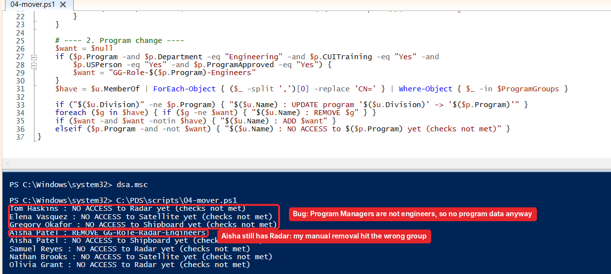

Two problems showed up at once:
1. **A bug:** the mover said Program Managers had "no access" to their programs. PMs own a program, but program **data** access is for engineers. I fixed it by checking the department
2. **My mistake:** Aisha still had Radar. So what did I remove?

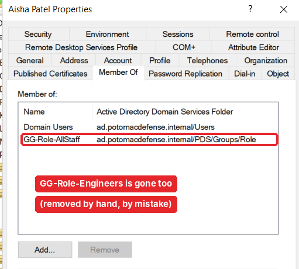

I'd removed **`GG-Role-Engineers`**, her birthright group, instead of Radar. Worse, the mover didn't notice the missing group, because it only compared program groups. So I added a birthright check that compares job-role groups to HR:

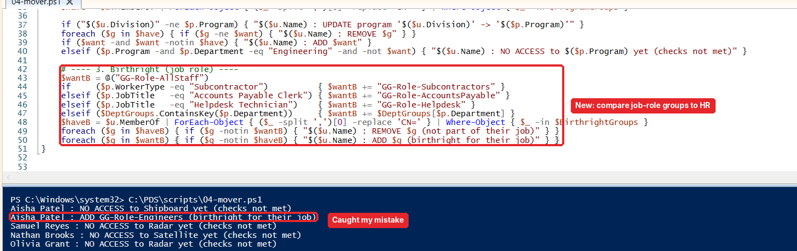

It caught my mistake right away, and also confirmed the other 23 accounts matched HR. I put Engineers back and removed Radar.

**Lesson:** manual changes need a check afterward, and a check is only as good as what it compares.

### PM approval

Then I changed `ProgramApproved` to **Yes** in the HR file and let the script finish the job:

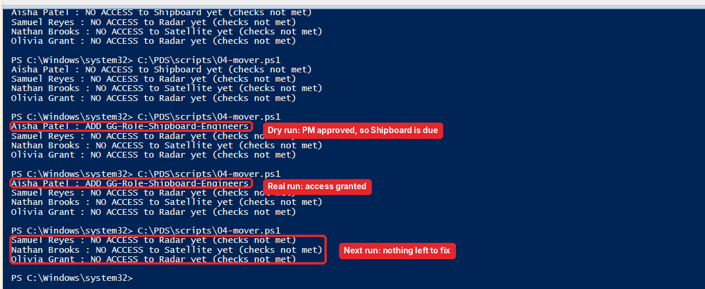

Dry run first (shows what it would do), then the real run (adds Shipboard), then one more run that finds **nothing left to fix**. That last run is how I know a change is done.

The mover always **removes before it adds**. If it fails partway through, the person ends up with too little access, never too much.

### Syncing it up

My manual sync failed:

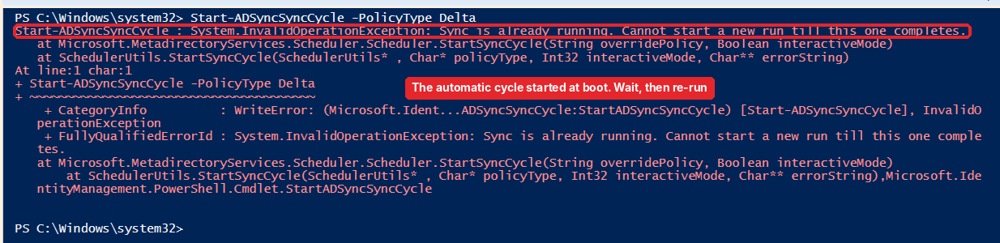

The automatic sync cycle had started when the server booted. I checked `Get-ADSyncScheduler`, waited and re-ran it. In Entra, Aisha is now in Shipboard, and I never touched the cloud by hand:

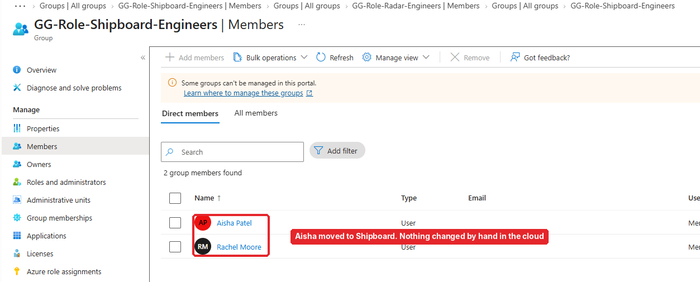

### Managers

The last piece links everyone to their manager, matched by **ManagerID → EmployeeID**, never by name:

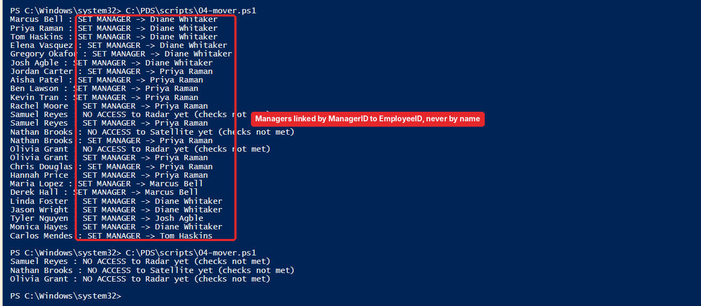

Managers approve and review their team's access, so access reviews depend on this field being right.

---

## 3. Doing it by hand first

Before automating the leaver, I did a full joiner and leaver **by hand** to understand what each step is for.

**Manual joiner:** I created Brian Keller and Erin Walsh in ADUC as if they'd been hired years ago (they're the leaver test cases), setting every field the joiner sets. Then I checked them against HR read-only:

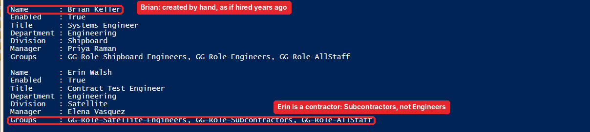

**Manual leaver (Erin):** her contract ended 9/30, but HR still showed her as Active. In order:

1. **Record her groups first.** This is the audit trail, and it's what you'd need if she were rehired

   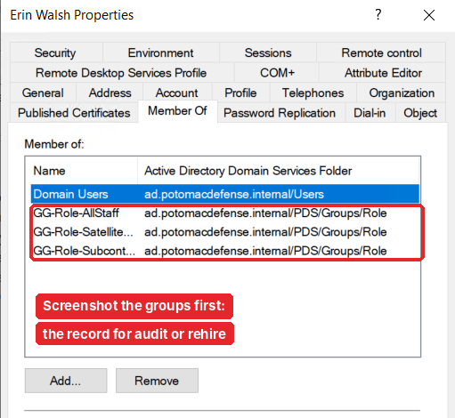

2. Removed all role groups
3. Disabled the account and reset the password to a random value
4. Description: who disabled it, when and why
5. Cleared her manager, so she drops out of her manager's access reviews
6. Moved her to `PDS\Disabled`
7. **Revoked her sessions in Entra**, without waiting for sync

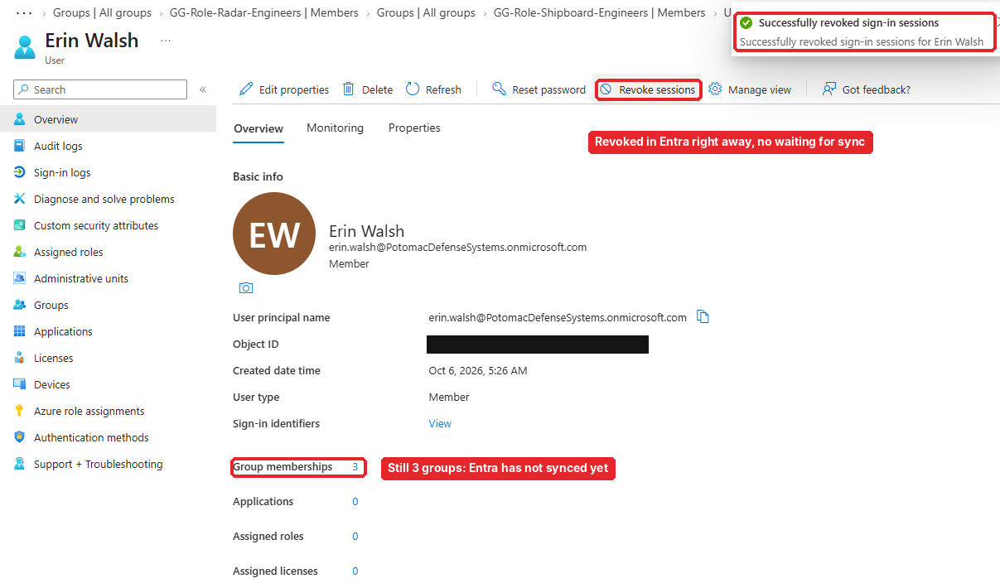

Look at "Group memberships: **3**." I'd already removed her groups in AD, but Entra hadn't heard yet. That's the gap: **disabling someone in AD doesn't sign them out of the cloud.** Entra only learns at the next sync, and existing tokens keep working until then. Revoking sessions closes part of that gap right away.

After the sync:

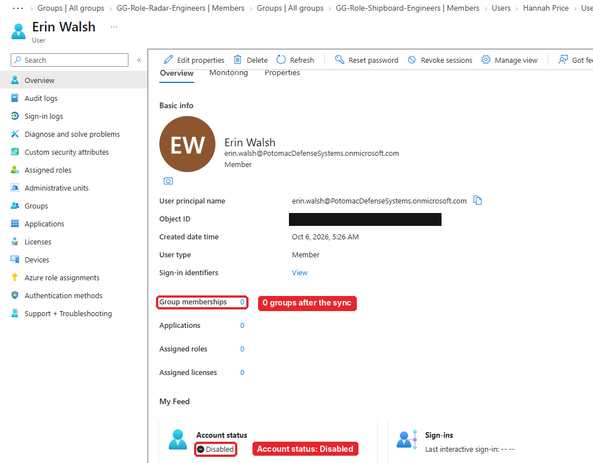

**What I learned:**
- **Locked out** (too many bad passwords, a helpdesk unlock) is not the same as **disabled** (an admin turned the account off). I mixed these up at first
- `Disabled` is in the sync scope on purpose. If Erin's account left the sync scope, Entra would delete her cloud account instead of showing it as disabled

---

## 4. Giving the engine cloud access

The leaver has to revoke Entra sessions with **no person signed in**, so the engine needs its own identity in Entra: an app registration called `PDS-JML-Engine`, talking to **Microsoft Graph** (Microsoft's API for Entra and Microsoft 365).

### A certificate, not a password

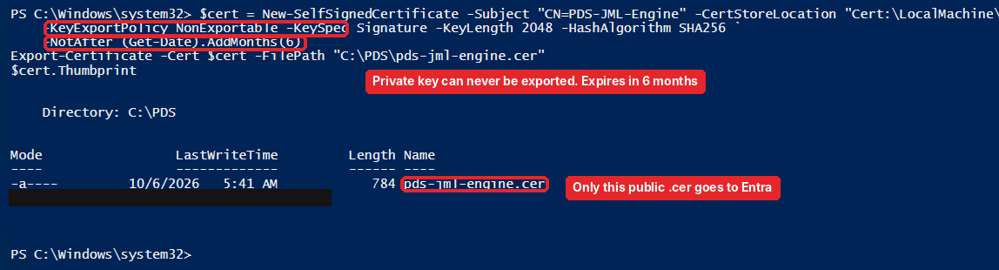

- The private key is **non-exportable**, so it can't be copied off the DC
- It expires in **6 months**, which forces rotation
- Only the public `.cer` file goes to Entra

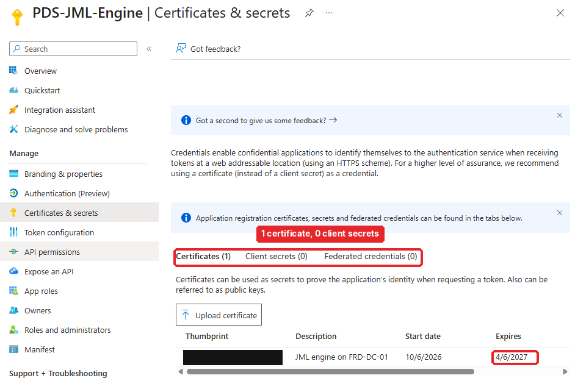

Zero client secrets. There's no password anywhere that could leak into a script, a chat or GitHub. (Thumbprints are blacked out here, and the public scripts use placeholders for every ID.)

### Two permissions, nothing more

I removed the default `User.Read` and granted only two **application** permissions:

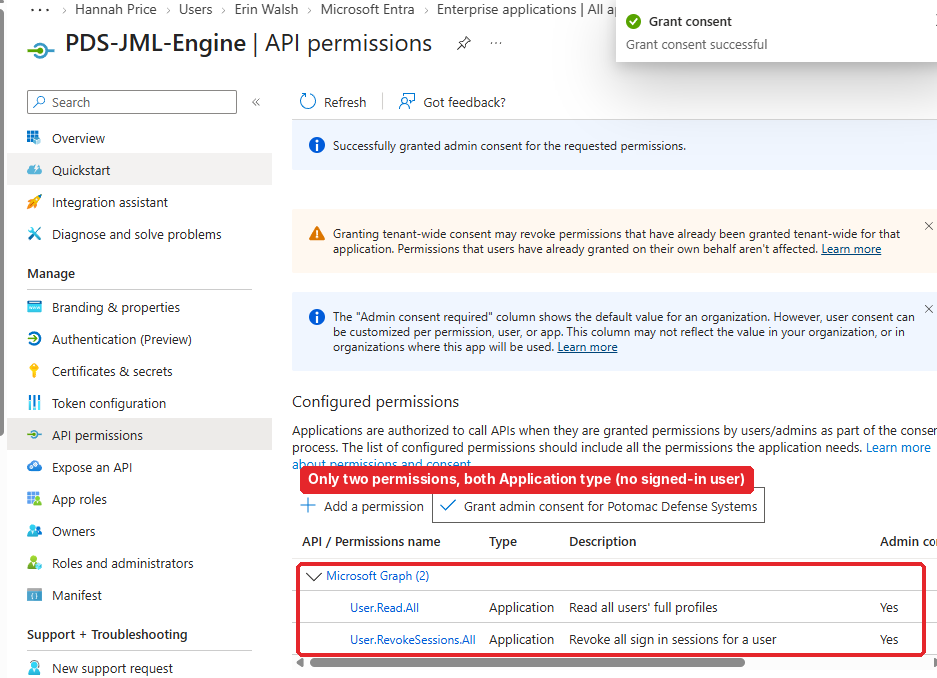

| Permission | Why |
|---|---|
| `User.Read.All` | Find the person by employeeId |
| `User.RevokeSessions.All` | Sign them out |

If this certificate were stolen, the attacker could read the user list and sign people out. They couldn't create admins, reset passwords or delete anyone. `Directory.ReadWrite.All` was the easy option and the wrong one.

On the DC I installed only `Microsoft.Graph.Authentication` (not the whole Graph SDK), from the official PowerShell Gallery. That's the second documented internet exception on Tier 0.

### The silent failure

I signed in as the app and tried to look up Brian by employeeId:

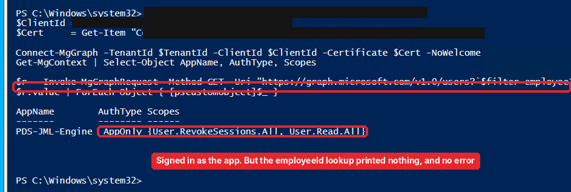

Signed in correctly (`AppOnly`, exactly two scopes). But the lookup returned **nothing, with no error**, even though Brian existed and his employeeId had synced. It turns out filtering on employeeId is an *advanced query* in Graph and needs an extra header (`ConsistencyLevel: eventual`) plus `$count=true`:

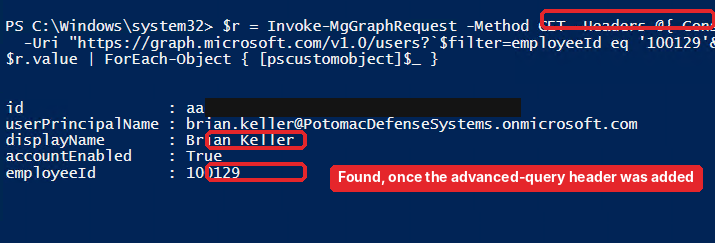

**This changed how the leaver handles "not found."** In a leaver, an empty result looks exactly like "this person has no cloud account," and that silent miss would leave someone signed in. So the engine treats "not found in Entra" as an **ERROR** to report, never as "nothing to do."

---

## 5. Leaver and the exposure window

`05-leaver.ps1` does the same steps as my manual leaver, in a deliberate order:

1. **Cut access first:** disable, scramble the password, revoke Entra sessions
2. **Clean up second:** record groups, remove groups, description, clear manager, move to `Disabled`

If the script fails halfway, the person is locked out with cleanup left over, rather than cleaned up but still able to sign in.

Leavers are anyone with HR status **Terminated**, or an **end date that has passed** (that catches contractors HR forgot to terminate).

Dry run first. Brian would be processed, and Erin is skipped because I already offboarded her by hand:

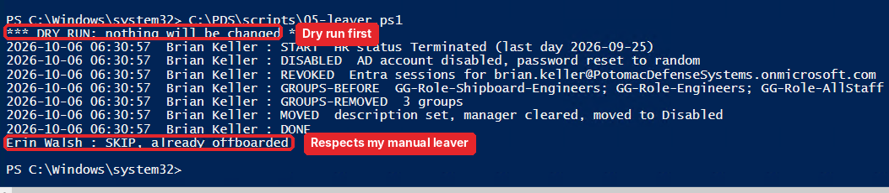

### Setting up the test

I wanted to know how long a fired employee could still get in. So I gave Brian a known password and signed in as him before running the leaver. Security defaults forced MFA registration (I didn't register a fake user on my phone), so Entra logged each attempt as **Interrupted**: the password was accepted, then the sign-in stopped at MFA setup. That status turned out to be the measuring stick.

### The real run

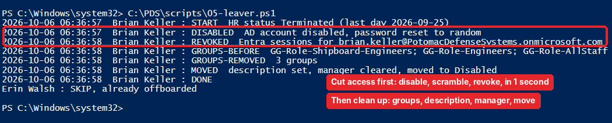

Disabled and sessions revoked within **1 second** of each other. Then I tried to sign in as Brian again and watched the sign-in log:

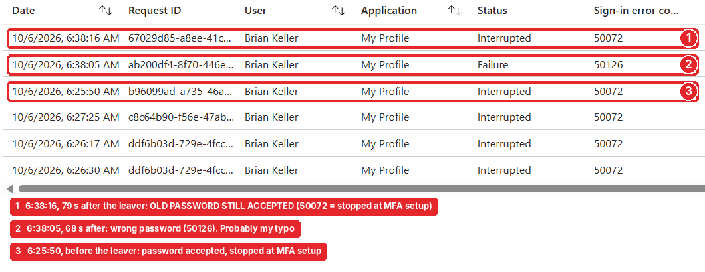

**I first misread this.** I saw the 6:38:05 failure ("invalid password," 68 seconds after the leaver) and wrote down "password dead at 68 seconds." Then I read the full list. Eleven seconds later, at 6:38:16, the **old password was accepted again**. The 68-second failure was most likely a typo on my part. One log entry isn't the whole story.

Last question: when does Entra show the account as disabled?

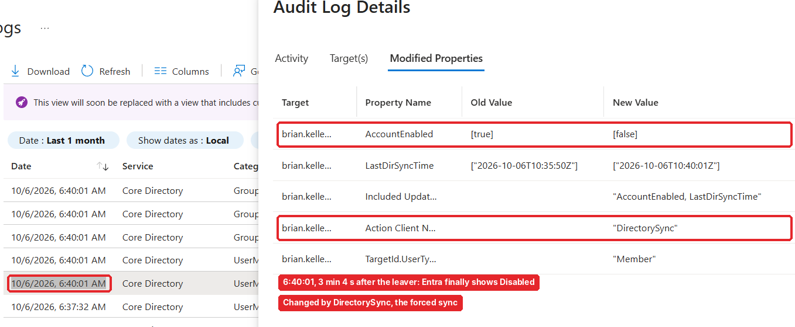

**6:40:01, 3 minutes 4 seconds after the leaver**, and only because I forced a sync. On the normal 30-minute schedule (the last sync before the leaver was 6:35:50), it would have been **about 29 minutes**.


There are three separate clocks:

| Clock | What closes it | Measured |
|---|---|---|
| Existing sessions | Revoke via Graph | **1 s** |
| Password | Password hash sync | still accepted at **79 s** |
| Account state in Entra | A sync | **3 min** forced, **~29 min** scheduled |

The only thing that stopped Brian's sign-in at 79 seconds was the MFA registration prompt. And because AD is the source of truth for a synced user, you can't just flip "enabled" in Entra. The fix for the last clock is triggering a sync.

---

## 6. Closing the gap

So I made the leaver trigger its own sync. If anyone was offboarded, it runs a delta sync on `FRD-SYNC-01` through PowerShell Remoting:

```powershell
Invoke-Command -ComputerName FRD-SYNC-01 -ScriptBlock { Start-ADSyncSyncCycle -PolicyType Delta }
```

If the sync can't start (already running, server off), the leaver logs it and moves on. The 30-minute schedule is the fallback, and a failed sync never undoes the offboarding. That closes the ~29-minute window without relying on someone remembering to click a button.

---

## 7. Separation of duties

**Rule from the role map:** nobody holds both `GG-Role-Finance` and `GG-Role-AccountsPayable`. One person could create a fake vendor and approve its invoice.

### By hand first

I played a helpdesk mistake: added **Maria Lopez** (an AP Clerk) to Finance. Then I found her the manual way, by comparing the Members tabs of the two groups:

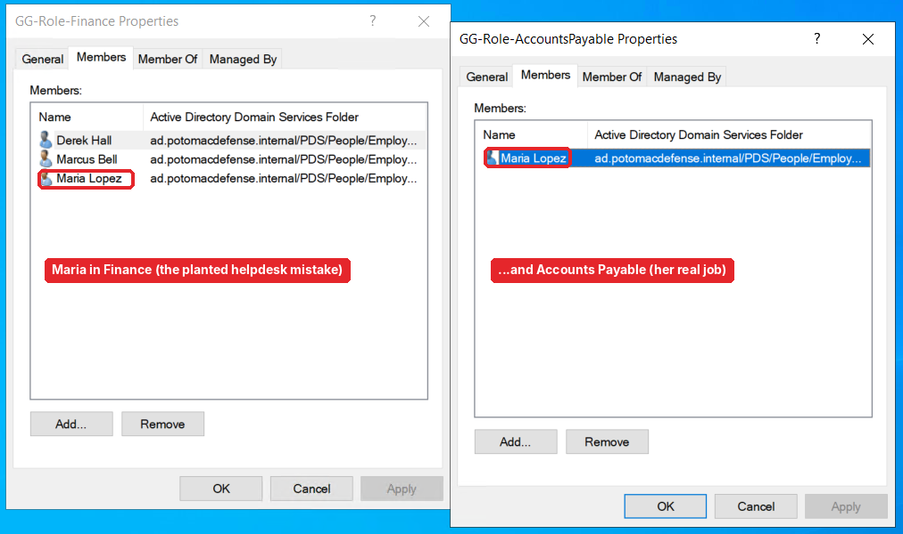

I checked the exceptions register (empty), and removed Finance, because HR says AP is her job.

**What broke:** twice my script said "No conflicts" after I thought I'd added Maria to Finance in ADUC. The change had never saved. I re-added her with PowerShell and confirmed membership before testing again.

### Then automated

`06-sod-check.ps1`:
- Finds anyone in both groups (recursively, so nesting can't hide a conflict)
- Checks [`data/sod-exceptions.csv`](../../data/sod-exceptions.csv). An exception only counts if it isn't expired, lasts **14 days or less**, and was approved by someone **other than the person or their own manager**
- No valid exception → keeps the group that matches HR, removes the other, raises an alert. Can't tell which is their job → flags REVIEW and changes nothing
- Alerts go to a CSV (for auditors) **and** the Windows event log, source `PDS-JML` (for a SIEM)

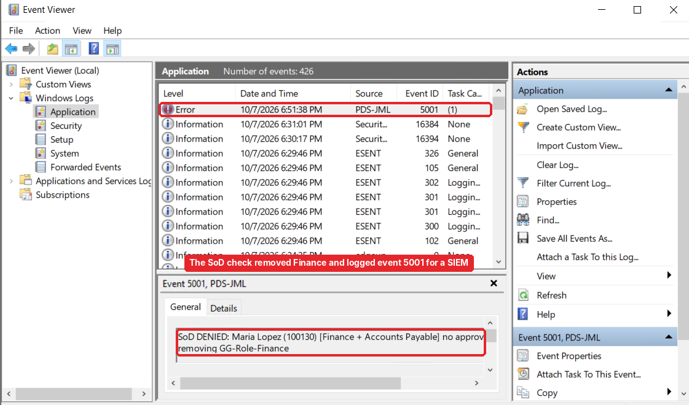

| Test | Exception | Result |
|---|---|---|
| Maria added to Finance | none | **DENIED**, Finance removed, event 5001 |
| Maria added to Finance | approved by Security, 7 days, compensating control | **ALLOWED**, kept, warning 5002 |
| Maria added to Finance | approved by her own manager (the CFO) | **DENIED**, event 5001 |

**What I learned:**
- This is a **detective + corrective** control, not a preventive one. AD has no setting that blocks the combination, so a conflict can exist between runs. That's why it runs on a schedule
- Two logs tell the full story. The Security log (4728/4729) shows *who changed the group and when*. The PDS-JML events show *what the control decided*
- **Known limitation:** the mover doesn't read the exceptions register, so its next run would remove an approved exception. In production, exceptions would live in the same IGA tool as everything else

---

## 8. Running unattended as a gMSA

The engine should run every day with nobody signed in. The question is: **as whom?** Not my admin account (that puts a Domain Admin password in a scheduled task), and not a Domain Admin at all.

The answer is a **group Managed Service Account**, `gmsa-jml`. Nobody knows its password. AD generates it, rotates it every 30 days, and only `FRD-DC-01$` can retrieve it. It lives in `ServiceAccounts`, outside the sync scope, so it never appears in Entra.

(First I created a KDS root key, which gMSAs need. I backdated it 10 hours as a lab shortcut since there's only one DC. In production I'd create it and wait.)

### Rights go to a group, not the account

The Delegation wizard's picker **can't find gMSAs**, even with the Computers object type and the `$` suffix. So I delegated to a group, `GG-Svc-JML-Engine`, and added the gMSA to it with PowerShell. That turned out to be the better pattern anyway: the gMSA can be swapped later without redoing any delegation.

**What broke:** I ran the group-membership delegation on the wrong OU:

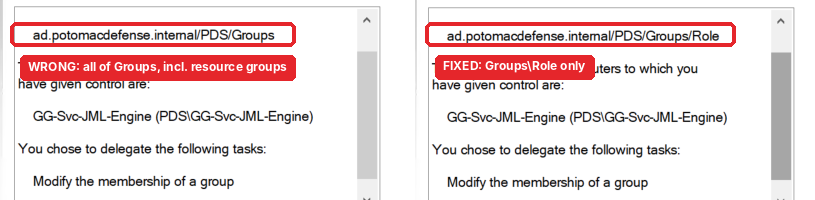

On `PDS\Groups`, the engine could change **resource group** membership too (like `DL-Share-Radar-CUI-Modify`). That's a back door around every CUI check. I removed the entries in Security → Advanced, redid it on `Groups\Role` only, and confirmed with `Get-Acl` that nothing was left on `Groups`.

The full set of rights:

| Right | Scope | Why |
|---|---|---|
| Create, delete, manage user accounts | `People`, `Disabled` | Joiner creates, mover edits, leaver disables and moves |
| Modify group membership | `Groups\Role` only | Every script changes role groups |
| Log on as a batch job | Default Domain Controllers Policy | Required to run as a scheduled task on a DC |
| Modify | `C:\PDS\logs` | Write logs |
| Read private key | Graph certificate | Sign in to Graph as `PDS-JML-Engine` |
| Remote Management Users + ADSyncOperators | `FRD-SYNC-01` | Trigger a delta sync |

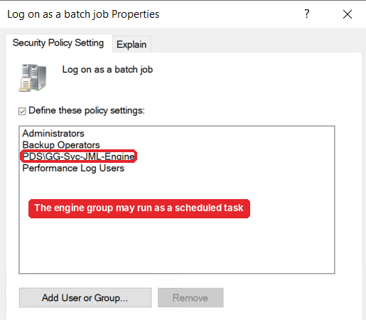

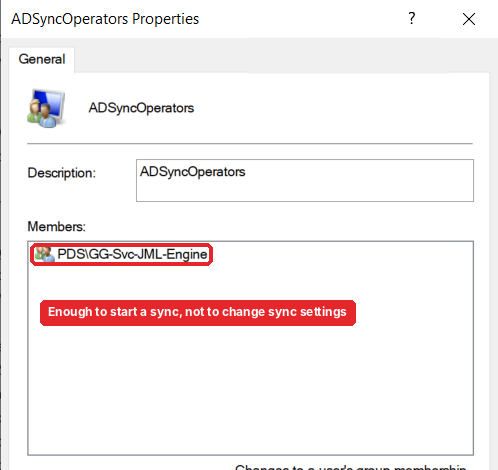

`ADSyncOperators` was enough to start a sync. The engine didn't need `ADSyncAdmins`. Tested from the DC:

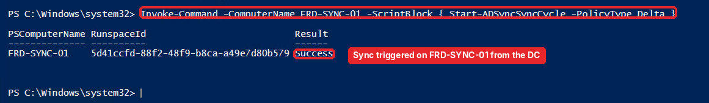

It has **no admin rights anywhere**. It can't touch admin accounts, admin groups, resource groups, servers or GPOs.

### Dry-run by default

Every script now starts with `param([switch]$Apply)`. Run by hand, it only prints decisions. Only the wrapper `run-jml.ps1` passes `-Apply`, and only the scheduled task runs the wrapper. The wrapper runs joiner → mover → leaver → SoD, records everything to a dated transcript, and writes `whoami` at the top as proof of who ran it.

The task runs daily at 8 PM (in production it would be early morning, but my lab VMs are off most of the day). First run:

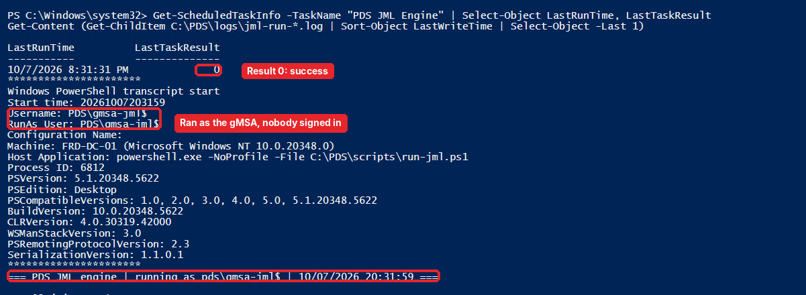

`LastTaskResult 0`, running as `PDS\gmsa-jml$`, and all four scripts ran, including the Graph sign-in with the certificate.

---

## 9. Scale test: 340 people

26 people proves the logic. I wanted to see it work at company size. I generated a 340-person roster (my 26 plus 314 new), a "next morning" version with 22 HR changes, and an [answer key](../../data/scale-test-expected.md) written **before** running anything. (Generated with LLM help.)

### Day 1: the "dry run" that wasn't

Before triggering the scheduled task, I ran the joiner by hand as a "dry run" to count how many accounts it would create. Then I started the task. 45 minutes later:

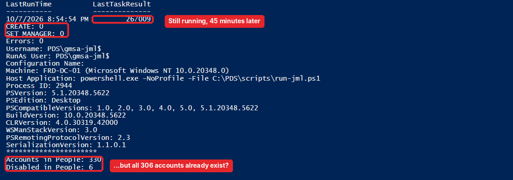

The task was still running (`267009`), the log showed **0** creates, but AD already had all **330** accounts. Something didn't add up. Two clues:
- The task's PowerShell process had used **0.8 seconds of CPU** in 45 minutes. That's far too little to have created 306 accounts
- So who did create them? I checked an account's **owner**:

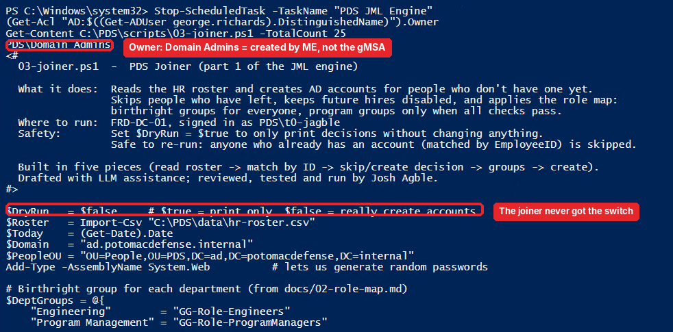

`PDS\Domain Admins`. If the gMSA had created it, the owner would be the gMSA. **I** created them. The joiner was the one script that never got the `-Apply` switch. It still said `$DryRun = $false` at the top, so my "pre-check" **created all 306 accounts as me**. Meanwhile, the task (started while my run was still going) sat waiting on something with no one to answer, and the mover never started.

**Fixed:**
- Added the switch to the joiner
- Verified all four scripts expose `-Apply` **without running them**: `(Get-Command .\03-joiner.ps1).Parameters.Keys -contains "Apply"`
- Added `-NonInteractive` to the task, so anything that ever prompts fails immediately instead of hanging
- Re-ran: the mover set all 306 managers as the gMSA in about 2 minutes

**Lesson:** verify the safety switch itself before trusting it. And object ownership in AD tells you who really created something.

### Day 2: overnight HR changes, run by the gMSA

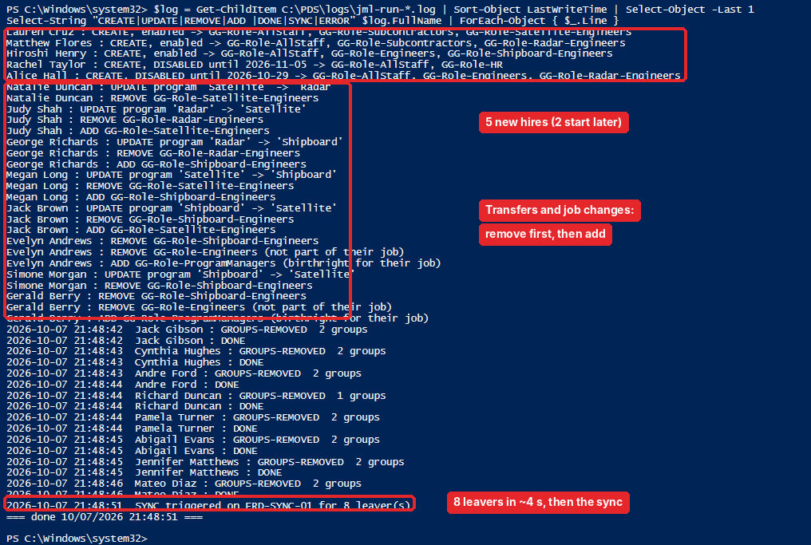

Every result matched the answer key:

| Change | People | Result |
|---|---|---|
| New hires | 5 | 5 created, 2 disabled until future start dates |
| Program transfer, approved | 4 | Old program group removed, new one added |
| Program transfer, not approved yet | 2 | Old group removed, no new access |
| Engineering → Program Management | 2 | Program + Engineers removed, ProgramManagers added, new manager |
| Manager change | 2 | Manager updated |
| Terminated / contract ended | 8 | Disabled, sessions revoked, groups removed, moved. All 8 found in Entra, 0 errors |
| Sync | 1 | `SYNC triggered on FRD-SYNC-01 for 8 leaver(s)` |

The 8 leavers took about **4 seconds**, and the sync was triggered 5 seconds later.

**Scaling note:** the engine looks up AD one person at a time. That's fine at 340, but at 10,000+ I'd load all users once at the start and look them up in memory.

## What I had at the end of 1.5

- [x] Joiner, mover, leaver and SoD check, each done by hand first, then automated
- [x] Graph app with a certificate and two permissions; "not found" treated as an error
- [x] A measured offboarding window, and the leaver now closes the biggest part of it
- [x] Running daily as a gMSA with no admin rights and no password anyone knows
- [x] 340 people, 22 overnight changes, 100% match with the answer key

---

[← 1.4 Hybrid identity](../1.4-hybrid-identity/README.md) · **1.5** · [Next: 1.6 Security review →](../1.6-security-review/README.md)
