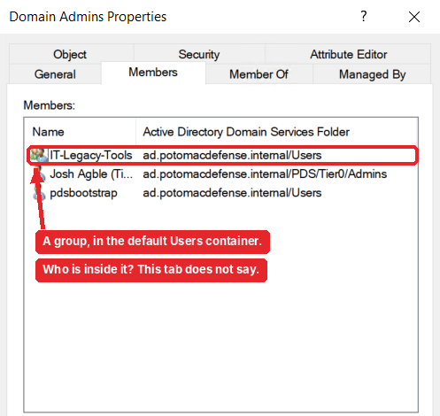
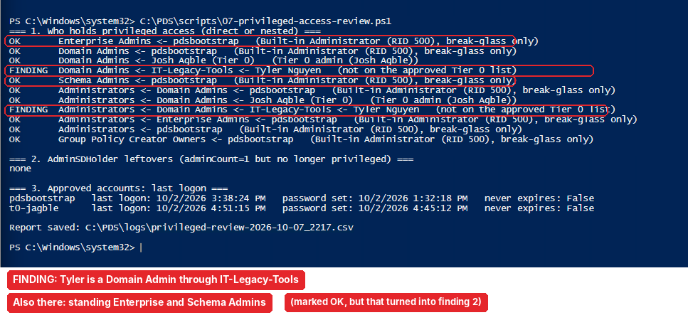
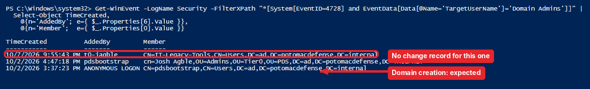
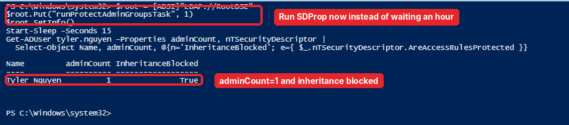
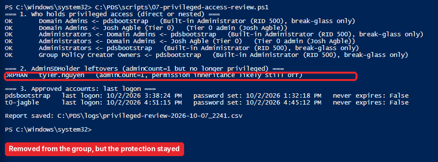
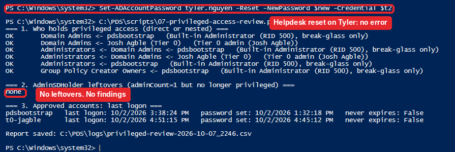

# Part 1.6: Security review

[← 1.5 Lifecycle automation](../1.5-lifecycle-automation/README.md) · **1.6** · [Back to the project →](../../README.md)

> **In this part:** I played a "previous admin" who left a Domain Admin path behind, then built a read-only review to find it. It found my planted problem **and two I didn't plant.** I investigated with the Security log before cleaning up, watched AdminSDHolder break the helpdesk live, and fixed everything.
>
> **Script:** [`07-privileged-access-review.ps1`](../../scripts/07-privileged-access-review.ps1) · **Report:** [Findings report](../../docs/04-privileged-access-review.md)

---

## Step 1: Plant the problem

The scenario: a previous admin left something behind. I created a group called `IT-Legacy-Tools` in the default `Users` container (the one PDS never uses, from Part 1.2), put **Tyler Nguyen**, a normal helpdesk user, inside it, and nested the group into **Domain Admins**.

Here's what a reviewer sees when they open Domain Admins:



A boring group name. Not Tyler. And if you open Tyler's own account, his Member Of tab shows `IT-Legacy-Tools` but never mentions Domain Admins. Clicking around ADUC, this is easy to miss.

## Step 2: Build a review that follows the nesting

`07-privileged-access-review.ps1` is **read-only by design**. It:

1. Expands 12 privileged groups (Domain, Enterprise and Schema Admins, Administrators, Account/Server/Backup/Print Operators, DnsAdmins, Group Policy Creator Owners, Key Admins, Enterprise Key Admins) **recursively, keeping the full path**, so nesting can't hide anyone
2. Compares every account to an approved Tier 0 list, with a reason for each (`t0-jagble`: Tier 0 admin; `pdsbootstrap`: built-in Administrator, break-glass)
3. Flags **AdminSDHolder leftovers** (more on that in Step 4)
4. Shows last logon for approved accounts and saves a CSV



There it is: `Domain Admins <- IT-Legacy-Tools <- Tyler Nguyen`, and the same path into **Administrators** (because Domain Admins is nested there).

But look at the first and fifth lines. The built-in Administrator is a standing member of **Enterprise Admins** and **Schema Admins.** I didn't plant that. Windows puts it there automatically when you create a forest. My script marked it OK because the *account* was approved, but my design said Enterprise Admins is just-in-time only (Part 1.4). The design wasn't actually true. That became finding 2.

## Step 3: Investigate before cleaning up

Before touching anything, I wanted to know **who did this and when**. Event **4728** is "a member was added to a security-enabled global group." The scale test in Part 1.5 generated thousands of them, so scrolling wasn't an option. I filtered to Domain Admins only:

```powershell
Get-WinEvent -LogName Security -FilterXPath "*[System[EventID=4728] and EventData[Data[@Name='TargetUserName']='Domain Admins']]"
```



That's the complete history of Domain Admins:

| When | Who added | Who was added | Verdict |
|---|---|---|---|
| 10/2, 3:37 PM | `ANONYMOUS LOGON` | `pdsbootstrap` | Expected: this is domain creation itself |
| 10/2, 4:47 PM | `pdsbootstrap` | my Tier 0 account | Expected: tiering setup |
| **10/7, 9:55 PM** | **`t0-jagble`** | **`IT-Legacy-Tools`** | **No change record. The finding** |

"ANONYMOUS LOGON added someone to Domain Admins" looks alarming, but it's normal at domain creation. Context before alarm. And this filtered query is basically a SIEM rule: *alert on any Domain Admins addition.*

## Step 4: Watch AdminSDHolder happen

When an account is in a protected group like Domain Admins, a background process called **SDProp** (every 60 minutes) stamps it `adminCount=1` and **turns off permission inheritance**, so delegated rights (like the helpdesk's password reset) can't reach it. I didn't want to wait an hour, so I triggered it manually:



Then I removed Tyler's path (took `IT-Legacy-Tools` out of Domain Admins and deleted the group) and re-ran the review:



Tyler is no longer privileged, but the protection **stayed**. Removing someone from Domain Admins doesn't undo `adminCount` or inheritance.

## Step 5: Prove the impact as the helpdesk

Does that leftover actually matter? I tested as `t2-jagble`, the helpdesk account:

| Test | Result |
|---|---|
| Reset Derek Hall (normal user, control) | ✅ Allowed |
| Reset Tyler (leftover protection) | ⛔ **Access is denied** |

The helpdesk can't support a user who **isn't even an admin anymore**. Every lockout for Tyler becomes a Tier 0 escalation. Enough of those, and admins start "just doing it themselves" with Tier 0 accounts, which is exactly what tiering exists to stop.

## Step 6: Fix and verify

| # | Finding | Severity | Fix |
|---|---|---|---|
| 1 | `Domain Admins <- IT-Legacy-Tools <- Tyler Nguyen` | Critical | Removed the nesting, deleted the group |
| 2 | Standing Enterprise + Schema Admins for the built-in Administrator | High | Removed it from both. Both groups are now **empty** until a specific change needs them |
| 3 | AdminSDHolder leftover on Tyler | Medium | Re-enabled inheritance, cleared `adminCount` |

Final check: the helpdesk reset on Tyler, then the review again:



- Helpdesk reset on Tyler: no error
- **No findings.** Enterprise Admins and Schema Admins are empty, and there are no leftovers
- The break-glass account was last used 10/2 (the domain build), as expected

## Limits I'd fix next

- The script approves an **account** for every privileged group. A better version approves **account + group pairs** (break-glass in Domain Admins: OK; standing Enterprise Admins: not OK). That would have flagged finding 2 directly
- It only sees privilege that comes from **group membership**. Rights granted directly on objects, like the Entra Connect account's directory replication rights, need a graph tool like BloodHound

## What I had at the end of 1.6

- [x] A planted hidden Domain Admin, found by a read-only review
- [x] Two real findings I didn't plant, investigated in the Security log before cleanup
- [x] AdminSDHolder seen live, with the helpdesk impact proven and fixed
- [x] A clean final review and a [findings report](../../docs/04-privileged-access-review.md)

---

**That's the whole project.** [← Back to the project overview](../../README.md)
